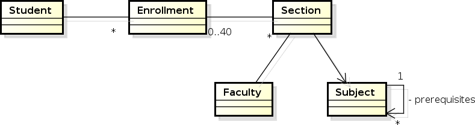

**Enrollment class** - Represents an enrollment by a student into sections for a particular semester.

# Current Requirements

## Student Enrolls for Section

#### Main Success Scenario:  

 1. Student enrolls in a section.  
 2. System verifies no schedule conflicts.    
 3. System verifies that student has taken the required prerequisite(s).  
 4. System adds section to student’s list of sections.   

#### Extensions:

 1. System detects schedule conflict  
  a. System does not add section to student’s list but instead returns message informing user of schedule conflict
 2. System detects prerequiste/s not yet taken.  
  b. System does not add section to student’s list but instead returns message informing user of prerequisite conflict

#### Business Rules:
* Student cannot enroll in two sections with the same schedule.
 	- Available schedules:
 		- Days:
 			- Mon/Thu, Tue/Fri, Wed/Sat
 		- Periods:
 			- 8:30am-10am, 10am-11:30, 11:30am-1pm, 1pm-2:30pm, 2:30pm-4pm, 4pm-5:30pm	 
* Student cannot enroll in a section if he/she has not taken the prerequisite.
 
# New Requirements

## Section Has Room, Room Has Maximum Capacity

* Section has a room attribute.
* Each room has a maximum capacity.
* Enlistment in each room may not exceed maximum capacity. 

## Create New Sections

#### Main Success Scenario:
* Section is created by selecting one teacher, one subject, one schedule and one room.
* If an business rules are violated, section is not created.

#### Business Rules:
 * A section is defined as a combination of a teacher, a subject, a schedule, a section number and a term.
 * Section numbers are manually assigned, but system must check that they are unique for the term.
 * Section numbers may duplicate as long as terms are different.
 * Each subject is worth three (3) units.
 * A teacher is identified by his/her Faculty ID.
 * A teacher cannot teach two sections with the same schedule.
 * No two sections can have the same room & schedule.

